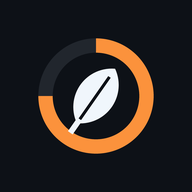
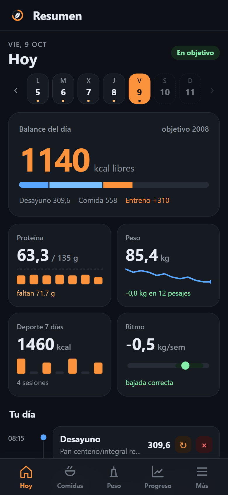
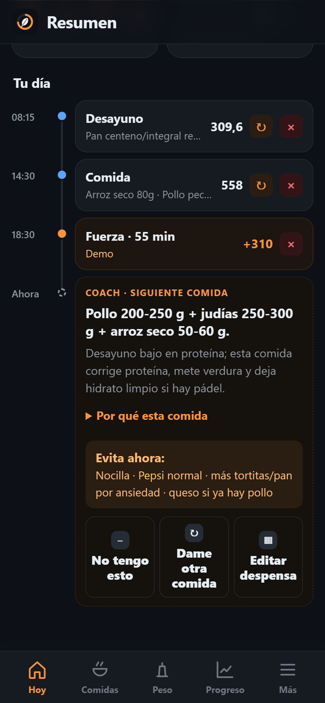
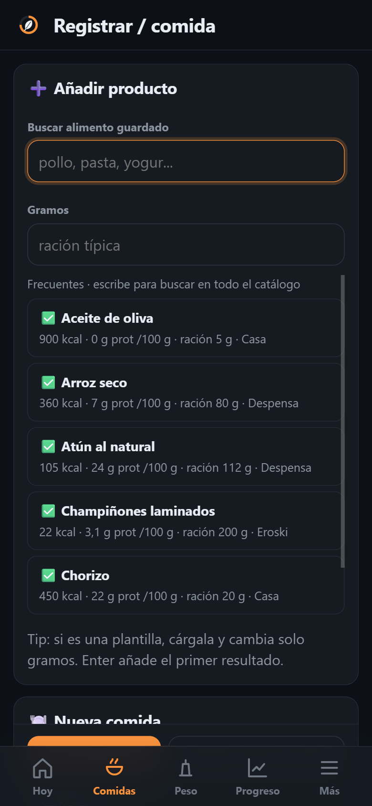
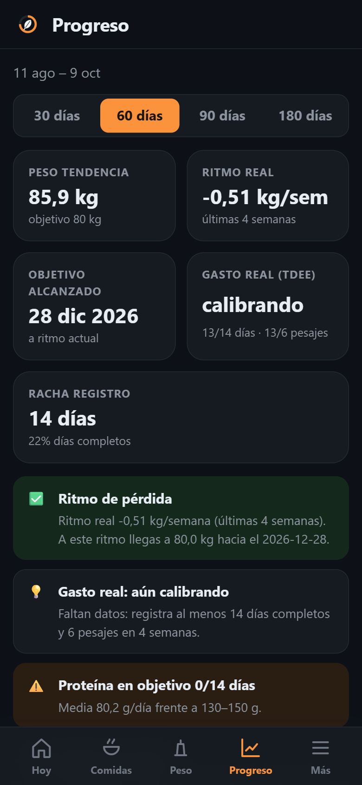

<div align="center">



# Diet Pro Planner

**Your nutrition, weight and training cockpit — self-hosted, private, phone-first.**

[](https://github.com/odegaard12/Diet-Pro-Planner/actions/workflows/ci.yml)
[](https://github.com/odegaard12/Diet-Pro-Planner/releases)
[](LICENSE)
[](#privacy)

&nbsp;
&nbsp;
&nbsp;


<sub>Screenshots use demo data. The interface is in Spanish.</sub>

</div>

---

Diet Pro Planner runs on a Raspberry Pi (or any Docker host) and turns what you eat, weigh and train into one clear
daily view: how many calories you have left, whether protein is on track, how your trend weight is moving and what
to eat next. Everything lives on your own server.

## Features

| | |
| --- | --- |
| **Today at a glance** | Week strip, daily balance (kcal left, intake by meal, workout), protein / weight / sport / rate tiles with mini charts, and your day as a timeline. |
| **Fast logging** | Search your catalog, load templates, change grams and save; repeat any meal with one tap. Barcode and name search via Open Food Facts, label OCR on-device. |
| **Smart Coach** | Suggests the next meal from what is actually in your pantry and what the day still needs; works without AI. |
| **Real progress** | Trend weight (EMA), real kg/week, goal date and measured TDEE from your own data; adherence and weekly tables. |
| **Sport** | Strava import with auto-sync, manual workouts, planned vs real training week. |
| **Goals** | Your own targets (manual, formula or adaptive calories) instead of hard-coded values. |
| **Optional AI (BYOK)** | Claude or a local Ollama for coaching and label reading; off by default. |
| **Web app** | Installable on the phone, dark theme, home-screen shortcuts, works offline with the last data seen. |
| **Safe data** | Versioned migrations with automatic backups, daily copies, SQLite download and CSV export. |

## Quick start

```bash
git clone https://github.com/odegaard12/Diet-Pro-Planner.git
cd Diet-Pro-Planner
cp .env.example .env          # set DPP_AUTH_TOKEN (long random string) or a user + password
docker compose up -d --build
```

Open `http://<your-server>:8099`, sign in and add it to your phone's home screen.

Update to a new release:

```bash
git pull && docker compose up -d --build --remove-orphans
```

Before migrating the database the app writes a backup to `data/backups/`.

## Configuration

All settings live in `.env` (see [`.env.example`](.env.example)):

| Variable | Purpose |
| --- | --- |
| `DPP_AUTH_TOKEN` | Login token (and bearer token for automation) |
| `DPP_ADMIN_USER`, `DPP_ADMIN_PASSWORD_HASH` | Optional user + password login (`python -m dpp_security hash-password`) |
| `STRAVA_*` | Optional Strava OAuth app |
| `ANTHROPIC_API_KEY`, `DPP_AI_*` | Optional AI (bring your own key); `DPP_AI_DAILY_LIMIT` caps calls per day |
| `DPP_OFF_ENABLED`, `DPP_OFF_COUNTRY` | Open Food Facts lookups |
| `DPP_BACKUP_KEEP` | Daily backups kept (0 disables) |
| `DPP_COOKIE_SECURE`, `DPP_TRUSTED_PROXIES` | Behind HTTPS / a reverse proxy |
| `TZ` | Local time zone (set in `docker-compose.yml`) |

More: session lifetimes, request limits and Docker hardening in [`docs/security.md`](docs/security.md).

## Privacy

- Food logs, weights, body composition, Strava tokens, photos and backups stay in `data/` on your server and are
  never committed (a CI guard blocks private files, private IPs, home paths and activity ids).
- Integrations are opt-in: Open Food Facts receives only a barcode or search text; AI only gets the minimal context.
- The installed web app keeps a read-only copy of the last data on your phone for offline use; signing out clears it.
- Nothing here is medical advice; bioimpedance values are trends, not daily truth.

## Security

Login with a token or user + scrypt password, server-side sessions with real logout, CSRF checks, rate-limited
login, strict input validation, security headers and a non-root, read-only container. Details:
[`docs/security.md`](docs/security.md) · report a vulnerability: [`SECURITY.md`](SECURITY.md).

## Development

```bash
python -m venv .venv && . .venv/bin/activate
pip install -r requirements.txt ruff
DPP_AUTH_TOKEN=dev python dpp_entrypoint.py     # http://localhost:8099
python -m unittest discover -s tests
```

CI runs lint, unit tests, the frontend and privacy guards, `pip-audit`, CodeQL and a real Docker smoke test.
Read [`CONTRIBUTING.md`](CONTRIBUTING.md) and [`CLAUDE.md`](CLAUDE.md) (architecture and conventions) before a PR.

## Documentation

- [`CHANGELOG.md`](CHANGELOG.md) — every release
- [`docs/API.md`](docs/API.md) — HTTP API
- [`docs/security.md`](docs/security.md) — access control and container hardening
- [`INTEGRACIONES.md`](INTEGRACIONES.md) — Strava and other integrations

## License

[MIT](LICENSE) · Not a medical device and not medical advice.

## Data credits

Supermarket products in `dpp_catalog_es.json` come from [Open Food Facts](https://world.openfoodfacts.org), available under the [Open Database License](https://opendatacommons.org/licenses/odbl/1-0/).
